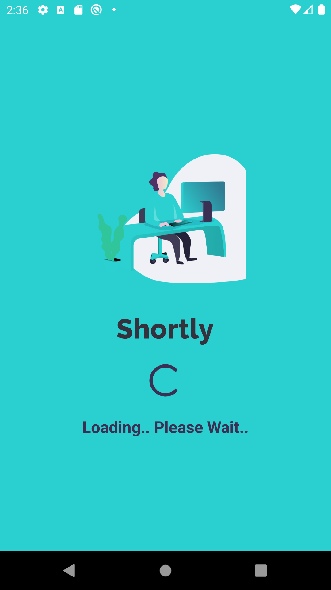

# SHORTLY

Android application that converts long links into short links

## Technologies
 **Kotlin Language, MVVM Architecture**

 - Material Design 
 - Lifecycle
 - Navigation
 - Coroutines 
  - Hilt
  -  Retrofit 
 - Room

## Photo

## Contributing
Pull requests are welcome. For major changes, please open an issue first to discuss what you would like to change.

Please make sure to update tests as appropriate.

## License
@melikeey
